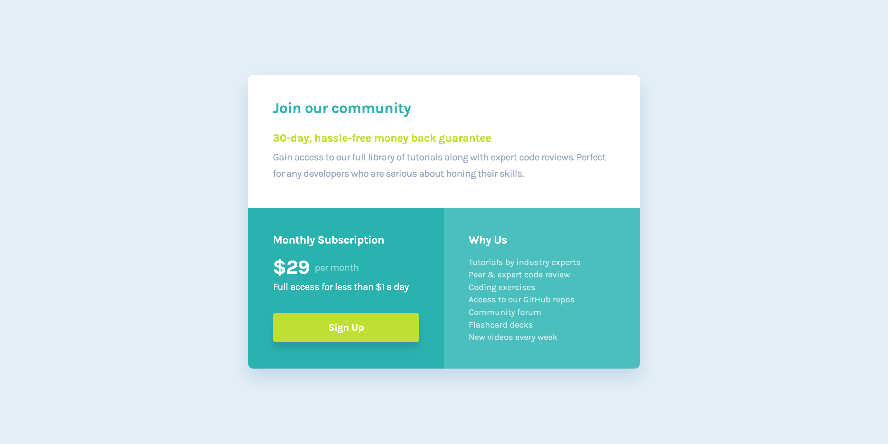

# Frontend Mentor - Single price grid component solution

This is a solution to the [Single price grid component challenge on Frontend Mentor](https://www.frontendmentor.io/challenges/single-price-grid-component-5ce41129d0ff452fec5abbbc). Frontend Mentor challenges help you improve your coding skills by building realistic projects.

## Table of contents

- [Overview](#overview)
  - [The challenge](#the-challenge)
  - [Screenshot](#screenshot)
  - [Links](#links)
- [My process](#my-process)
  - [Built with](#built-with)
  - [What I learned](#what-i-learned)
  - [Continued development](#continued-development)
  - [AI Collaboration](#ai-collaboration)
- [Author](#author)

**Note: Delete this note and update the table of contents based on what sections you keep.**

## Overview

### The challenge

Users should be able to:

- View the optimal layout for the component depending on their device's screen size
- See a hover state on desktop for the Sign Up call-to-action

### Screenshot

### Links

- Solution URL: [Add solution URL here](https://your-solution-url.com)
- Live Site URL: [Add live site URL here](https://your-live-site-url.com)

## My process

### Built with

- Semantic HTML5 markup
- CSS custom properties
- Flexbox
- Mobile-first workflow

### What I learned

The most challenging thing about this project was the naming. I should have taken a little bit of time to come up with better names for my classes. Instead I used names like "section one", "section two", "subsection one one"... It quickly became a mess, and it was hard to follow what to what, so I mixed up the styles in my CSS. In the end I had to refactor the names. I learned that names matter.

### Continued development

This is my tenth project so far, and I've noticed that most of them are always a few pixels off. I need to work on finding out why that is and how to fix it.

### AI Collaboration

I used ChatGPT for refactoring at the end.

## Author

- Frontend Mentor - [@Kristina2025](https://www.frontendmentor.io/profile/Kristina2025)
